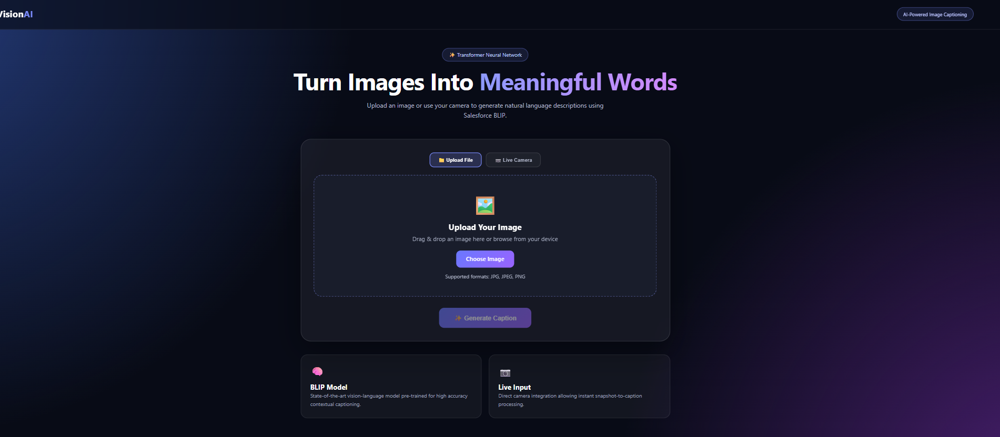
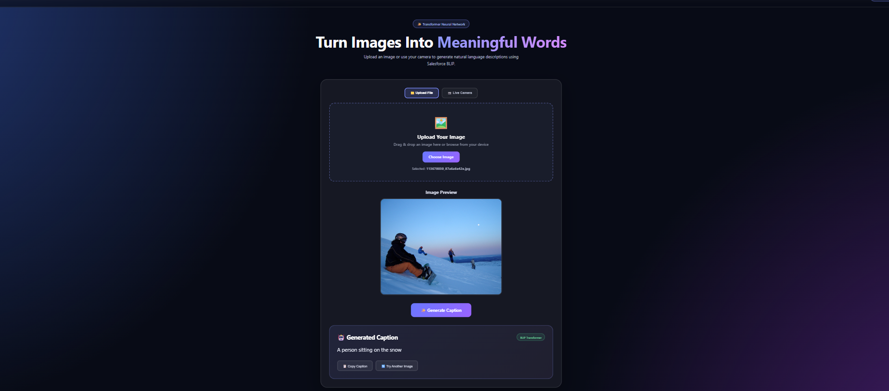
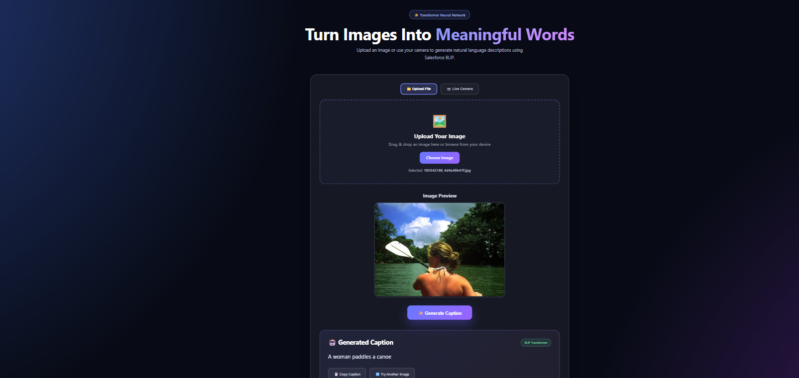

# VisionAI - AI Image Caption Generator

VisionAI is an AI-powered Image Caption Generator that automatically analyzes images and generates natural-language descriptions using a state-of-the-art **BLIP Transformer model**.

The application is built using **Python, Flask, PyTorch, and Hugging Face Transformers**. It supports both **image upload** and **live camera capture** for generating captions.

---

## 🚀 Features

- Upload an image and generate an AI caption
- Capture an image directly using a live camera
- High-quality image caption generation using BLIP
- Uses Salesforce BLIP Image Captioning model
- Supports JPG, JPEG, PNG and WEBP images
- Flask-based web application
- Simple and user-friendly interface
- CPU and GPU support
- Real-time caption generation

---

## 🧠 How It Works

The system follows this pipeline:

**Input Image / Camera Image**
↓
**Image Preprocessing**
↓
**BLIP Processor**
↓
**Salesforce BLIP Transformer Model**
↓
**Caption Generation**
↓
**Natural Language Caption**

The user can either upload an image or capture an image using the live camera.

The image is converted into RGB format and processed by the BLIP processor. The processed image is then passed to the pretrained BLIP Transformer model, which generates a natural-language description of the image.

---

## 🤖 AI Model

This project uses:

**Salesforce BLIP - Image Captioning Base**

Model:

`Salesforce/blip-image-captioning-base`

BLIP (Bootstrapping Language-Image Pre-training) is a vision-language model designed for tasks such as image captioning and visual question answering.

The pretrained BLIP model allows the application to generate meaningful captions for previously unseen images without requiring the model to be trained from scratch.

---

## 🛠️ Technologies Used

- Python
- Flask
- PyTorch
- Hugging Face Transformers
- BLIP
- Salesforce BLIP Image Captioning
- Pillow (PIL)
- HTML
- CSS
- JavaScript
- Base64
- Git
- GitHub

---

## 🖼️ Screenshots

### 🏠 Home Page

The VisionAI home page provides a simple and user-friendly interface for uploading images and generating AI-powered captions.



---

### 📷 Image Upload / Camera

Users can upload an image from their device or capture an image using the live camera feature.



---

### 🤖 AI Generated Caption

After processing the image using the Salesforce BLIP Transformer model, the application generates a natural-language caption describing the image.



## 📂 Project Structure

```text
Image-Caption-Generator/
│
├── app.py
├── requirements.txt
├── README.md
│
├── templates/
│   └── index.html
│
├── static/
│   └── ...
│
├── dataset/
│   └── ...
│
├── models/
│   └── ...
│
└── .gitignore
⚙️ Installation
1. Clone the Repository
git clone https://github.com/ajayrai-eng/Image-Caption-Generator.git
2. Navigate to the Project Folder
cd Image-Caption-Generator
3. Create a Virtual Environment
python -m venv venv
4. Activate the Virtual Environment

For Windows:

venv\Scripts\activate
5. Install Dependencies
pip install -r requirements.txt

The required BLIP model will be downloaded automatically from Hugging Face during the first application startup.

▶️ Run the Application

Start the Flask application:

python app.py

The application will run locally at:

http://127.0.0.1:5000

Open this address in your web browser.

🖼️ Usage
Method 1: Upload an Image
Open the VisionAI web application.
Select an image from your computer.
Upload the image.
Click the Generate Caption button.
The BLIP AI model processes the image.
The generated caption is displayed on the screen.
Method 2: Live Camera
Open the VisionAI web application.
Allow camera permission when requested.
Open the live camera interface.
Capture an image.
The captured image is sent to the Flask backend.
The BLIP model analyzes the image.
The generated caption is displayed.
🔄 Application Workflow
User
 │
 ├── Upload Image
 │
 └── Capture Image Using Camera
          │
          ▼
      Flask Backend
          │
          ▼
     Image Processing
          │
          ▼
     BLIP Processor
          │
          ▼
 Salesforce BLIP Model
          │
          ▼
  Caption Generation
          │
          ▼
   Generated Caption
          │
          ▼
     User Interface
🧩 Backend Architecture

The Flask backend performs the following tasks:

1. Model Loading

The BLIP model and processor are loaded when the application starts.

2. Image Input Handling

The application supports two input methods:

Multipart image file upload
Base64 encoded camera image
3. Image Processing

Uploaded or captured images are converted into RGB format using Pillow.

4. Caption Generation

The processed image is passed to the BLIP Transformer model.

5. Result Delivery

The generated caption is returned to the frontend using a JSON response.

🔬 Model Architecture

The project uses the BLIP (Bootstrapping Language-Image Pre-training) architecture for image caption generation.

The model combines visual understanding and natural language generation.

The workflow is:

Image
  │
  ▼
Vision Encoder
  │
  ▼
Visual Representation
  │
  ▼
Language Generation Module
  │
  ▼
Natural Language Caption

Unlike the earlier CNN-LSTM implementation, the current version uses a pretrained Transformer-based vision-language model, providing better generalization to new and unseen images.

📌 Current Status

The current version of VisionAI is a working AI-powered image captioning prototype.

The application can:

Accept uploaded images
Capture images using a live camera
Process previously unseen images
Generate natural-language captions
Run locally using Flask
Use CPU or GPU depending on available hardware

The project currently uses the pretrained Salesforce BLIP image-captioning model.

🔮 Future Scope
Improve caption accuracy and contextual understanding
Add multilingual caption generation
Add voice output for generated captions
Deploy the application on a cloud platform
Add real-time video captioning
Add object detection and object recognition
Add image question-answering functionality
Add voice-based interaction
Develop a mobile application
Optimize inference speed
Add support for multiple AI vision-language models
Add accessibility features for visually impaired users
📊 Advantages
Works with previously unseen images
Does not require manual caption creation
Uses a pretrained state-of-the-art vision-language model
Supports both image upload and live camera input
Simple web-based interface
Can run on CPU and GPU
Easily extendable for future AI vision applications
👨‍💻 Author

Ajay Rai

BE Information Technology Student

GitHub: ajayrai-eng

⭐ Project

If you find this project interesting, consider giving it a star ⭐
